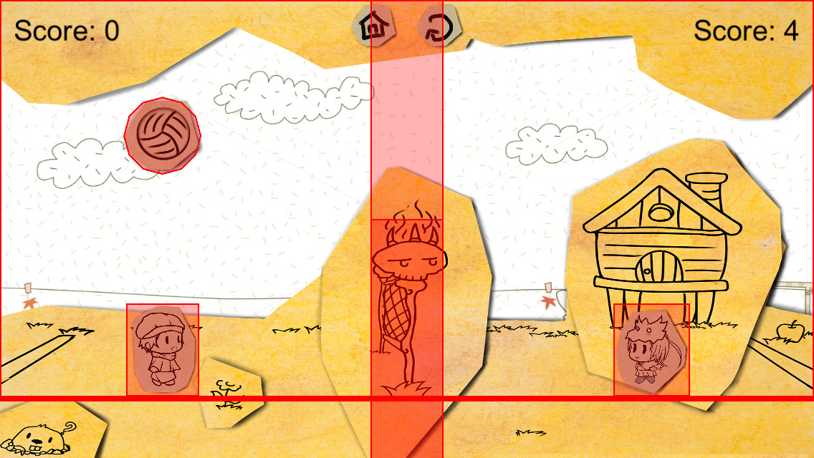

##介绍
- 本游戏是一个由Cocos2d-X框架开发的移动平台的排球游戏。本次，我们主要针对iOS平台开发，这个游戏可以完美的在装有iOS系统的设备下运行。但是基于Cocos2d-X框架的跨平台特性，本游戏可以轻松的移植到Android和Windows Phone平台。
- 本游戏的游戏规则与真实的排球游戏相似。在每局游戏的开始，排球会在某一方角色的上方，自由落下。玩家可以控制游戏角色移动、跳跃，尽可能的将排球击打到对方的场地上。如排球落在一方的场地上，则对方获得加分。
- 在跳跃的过程，如角色碰到排球，玩家可以控制角色发出撞击特效，排球会以更快的速度飞向对方场地。
- 在接球的过程，如遇到球速过快的情况，玩家可以控制角色发出扑救特效，角色会翻到以获得更大的接触面积来救球
- 由于本游戏是基于移动平台开发，我们试图尽可能发挥移动端的特性，以得到更好的用户游戏体验。所以游戏中的所有的操作都是利用触摸手势控制。左右移动为左右滑动，跳跃为向上滑动，扑救和撞击为向下滑动。

##环境
- 开发环境：Xcode 6.3.1 或更新的版本
- 运行环境：iOS 8.0 或更新的版本

##架构
###Welcome Scene
####主要负责构建开始游戏的场景。

* Background Layer
	* Welcome Scene的背景层，负责绘制场景的背景。
* Button Layer
	* Welcome Scene的按键层，负责绘制场景内的所有按键，以及负责按键的反馈。

###Help Scene
####主要负责构建帮助的场景。

* Background Layer
	* Help Scene的背景层，负责绘制场景的背景。
* Button Layer
	* Help Scene的按键层，负责绘制场景内的所有按键，以及负责按键的反馈。

###Game Scene
####主要负责构建游戏的场景。

* Background Layer
	* Game Scene的背景层，负责绘制场景的背景。
	* 该背景层由两张图片绘制，一张为游戏场景的前景框架，另一张为背景，后续可更换此背景图片。
* Player Layer
	* Game Scene的游戏层，负责整个游戏的逻辑及控制。
	* 该层包含了触控检测以及碰撞检测。
* Player Sprite
	* 游戏角色的精灵类。
	* 负责游戏角色的生成，以及游戏角色的跳跃和扑救的动作控制。

##实现
###物理引擎
游戏场景效果主要由Cocos2d-X的物理引擎实现。
物理世界的构建如下：

* 球网的设置：通过对相同位置添加了两种高度不同的Physics Body,设置不同的Contact Category，达到上方排球可以通过，而角色无法通过，下方角色和排球都无法通过。
* 角色跳跃实现：向角色添加向上的速度属性
* 角色撞击排球实现：向排球添加向对面场地方向的速度属性

###AI（人工智能）
本游戏主要采用了FSM(Finite State Machine)有限状态机 AI设计类型。

* 敌方角色会判断排球的位置，向排球的位置移动。
* 当排球位于地方角色的一定位置内，会跳跃发出撞击特效。

